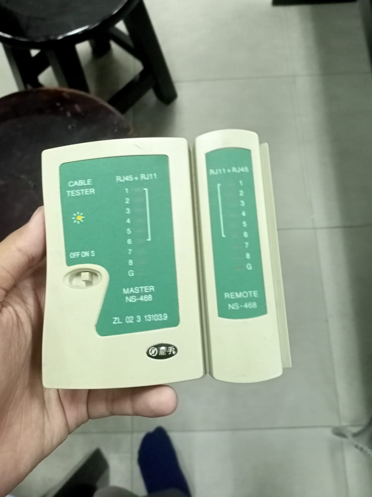

# 
Laporan Praktikum Konsep Jaringan 

## 1. Dasar Teori
Pada pertemuan pertama praktikum konsep jaringan, topik yang dibahas adalah media penghubung dalam jaringan yaitu media jaringan komputer
### 1.1 Media Jaringan Komputer
&nbsp;&nbsp;&nbsp;&nbsp;&nbsp;&nbsp;&nbsp;Media jaringan komputer adalah perangkat yang menjadi perantara dari satu perangkat jaringan dengan yang lain.perangkat yang digunakan untuk melakukan pengiriman data dalam bentuk bit. Dalam penerapannya, media jaringan komputer memiliki beberapa jenis yaitu
1. Kabel Listrik

    
    
    Kabel listrik dapat diartikan seperti pengiriman data menggunakan media listrik. Jadi semua data diubah dalam gelombang elektro magnet dan dikirimkan melalui kabel ini. Untuk jenis kabelnya ada beberapa versi, namun yang populer digunakan saat ini adalah kabel UTP (Unshielded Twisted Pair) dan STP (Shielded Twisted Pair). Pada dasarnya kedua kabel tersebut sama, perbedaannya hanya pada STP memiliki 1 lapisan aluminium foil yang digunakan untuk melindungi kabel yang ada di dalamnya dari gangguan elektro magnet perangkat disekitanya. Pembahasan pada kali ini akan berfokus pada media ini karena cukup mudah untuk diterapkan.
2. RF (Wireless)

    

    Media yang digunakan pada perangkat ini adalah gelombang radio atau Radio Frequency. Jadi data dikirimkan melalui variasi gelombang yang dipancarkan melalui udara. Protokol yang umum digunakan adalah Wifi atau 802.11 . 
3. FO (Pulsa Cahaya)

    

    Media selanjutnya adalah melalui cahaya atau biasa kita sebut dengan fiber optic. Kabel ini digunakan untuk mengalirkan data yang dibentuk dalam pulsa cahaya.

&nbsp;&nbsp;&nbsp;&nbsp;&nbsp;&nbsp;&nbsp;Dari ketiga jenis penyaluran data tersebut, kita bisa langsung setuju bahwa media fiber optic menjadi media yang paling cepat dan media kabel listrik menjadi yang terlambat. Namun jika dilihat dari sisi teknis, semua memiliki kelebihan dan kekurangan tersendiri. Satu misal, untuk pembuatan media fiber optic membutuhkan biaya yang cukup besar dan kabel yang digunakan harus benar benar lurus, tidak boleh patah ataupun bengkok terlalu dalam. Begitu pun sebaliknya, meskipun media kabel listrik memiliki kecepatan yang lebih lambat, namun penggunaannya lebih fleksibel. Pembuatannya pun lebih mudah dan murah. Maka dari itu kita juga akan mempraktikkan cara pembuatannya.
### 1.2 Standart Kabel UTP

Kabel UTP memiliki beberapa standart yang sudah diatur oleh ANSI dan sampai saat ini masih berkembang seiring berjalannya waktu. Standart yang saat ini sudah ada antara lain

1. Level 1 / CAT 1

    Level Ini merupakan kategori pertama yang dipakai untuk menjalankan jaringan komputer. Kabel dengan standart ini memiliki bandwith sebesar 1 MHz

2. CAT 2

    Yang kedua adalah CAT 2. Kategori ini merupakan kategori pertama yang menggunakan pasangan 2 kabel yang dipilin, karena sebelumnya semua kabel dipilin menjadi 1. Kabel dengan kategori ini memiliki bandwith maksimum sebesar 4 MHz.

3. CAT 3

    Yang ketiga adalah CAT 3. Kabel dengan kategori ini merupakan standart pertama yang termasuk dalam standart rekomendasi dari TIA/EIA (Electronic Industries Alliance / the Telecommunications Industry Association). Kabel dengan kategori ini mampu melakukan transmisi data yang mendukung suara/voice. Bandwith maksimal dari kabel dengan kategori ini adalah 16 MHz.

4. CAT 4

    Selanjutnya adalah kategori 4. Kabel dengan kategori ini dulu digunakan untuk teknologi token-ring dan menjadi dasar pengembangan teknologi kabel selanjutnya yaitu CAT 5. Bandwith maksimal dari kabel dengan kategori ini adalah 20 MHz.

5. CAT 5

    Selanjutnya lagi adalah kabel UTP dengan kategori 5. Kabel dengan kategori ini merupakan kabel yang umum digunakan saat ini karena mampu melakukan transmisi data dengan bandwith sebesar 100 MHz. Bandwith tersebut mampu menangani transmisi video sampai kualitas 1080p.

6. CAT 5e

    Kategori ini merupakan pembaharuan dari CAT 5 yang mampu mentransmisikan bandwith sebesar 100 Mbps. Kabel UTP dengan kategori ini merupakan yang paling umum dipakai saat ini. Baik untuk penggunaan rumahan maupun kantor dengan bandwith yang tidak terlalu besar untuk masing masing perangkat.

7. CAT 6

    UTP CAT 6 merupakan kabel yang umum digunakan untuk menjadi backbone dari jaringan LAN dan karena memiliki bandwith sampai dengan 1 Gbps. Baik untuk upload maupun download.

8. CAT 6a

    UTP CAT 6e merupakan pembaharuan lagi dari kategori sebelumnya dengan kualitas yang lebih baik dari segi konsistensi bandwith maupun bahan pembuatan kabelnya.

9. CAT 7

    UTP CAT 7 merupakan generasi selanjutnya dari kabel UTP. Kabel ini mampu mentransmisikan data dengan besar bandwith 10 Gbps. Panjang kabel maksimal yang dapat ditempuh juga lebih panjang yaitu 100 m yang sebelumnya hanya sampai 80 m.

10. CAT 7a

    CAT 7a merupakan kabel UTP yang digunakan untuk transmisi data jarak dekat dengan bandwith yang lebih besar. Bandwith yang dapat ditampung sampai dengan 40 Gbps dengan panjang kabel 50 m

11. CAT 8

    Kategori ini merupakan kategori baru dengan bandwith 2000 MHz dengan panjang maksimal kabel hanya 30m.

### 1.3 Koneksi dengan kabel UTP

&nbsp;&nbsp;&nbsp;&nbsp;&nbsp;&nbsp;&nbsp;Koneksi yang digunakan pada kabel UTP memiliki 2 jenis, yaitu

1. Straight

    Koneksi dengan jenis ini digunakan untuk menghubungkan 2 perangkat dengan jenis yang berbeda. Misal kita akan menghubungkan perangkat router dengan access point, kita membutuhkan kabel dengan jenis koneksi ini. Hal itu berhubungan dengan cara pengiriman data dan penerimaan data dari masing masing perangkat jaringan. Transmisi yang dilakukan oleh perangkat pertama akan diterima oleh perangkat yang selanjutnya pada pin yang sama.

2. Cross over

    Jenis koneksi kedua adalah cross-over. Koneksi dengan jenis ini ditujukan kepada koneksi yang menghubungkan 2 perangkat dengan jenis yang sama. Misal kita akan menghubungkan perangkat router dengan
&nbsp;&nbsp;&nbsp;&nbsp;&nbsp;&nbsp;&nbsp;Koneksi yang digunakan pada kabel UTP memiliki 2 jenis, yaitu router lainnya, kita membutuhkan kabeh utp dengan jenis koneksi ini. Karena proses pengiriman data berada pada pin yang sama dengan perangkat sebelumnya. Misal pada suatu perangkat, proses pengiriman data pada pin pertama, maka akan diterima oleh perangkat selanjutnya pada pin ke 4. Begitu pun sebaliknya. Namun seiring berjalannya waktu, perkembangan teknologi memungkinkan adanya pendeteksian jenis kabel yang digunakan. Jadi kita tidak perlu khawatir lagi dengan ujung kabel yang kedua memakai konfigurasi yang mana. Semua bisa dihandle menggunakan susunan straight.

## 2. Pembuatan Kabel UTP

### 2.1 Alat yang disiapkan dan kegunaannya

&nbsp;&nbsp;&nbsp;&nbsp;&nbsp;&nbsp;&nbsp;Dalam pembuatan kabeh UTP, kita membutuhkan beberapa hal yaitu 

1. Tang Krimping UTP

    Tang ini digunakan untuk memotong, mengupas, serta melakukan krimping terhadap konektor RJ45 yang akan kita gunakan pada kabel UTP ini.

2. Konektor RJ-45

    Konektor RJ45 merupakan konektor yang sudah disepakati oleh ANSI sebagai konektor yang digunakan untuk kabel UTP. Konektor ini juga mengikuti jenis kabel yang digunakan. Misal kita akan melakukan krimping pada kabel dengan jenis CAT 5e, maka kita harus menggunakan konektor dengan jenis CAT 5e juga.

### 2.2 Langkah pembuatan kabel Straight

Langkah-langkah pembuatan kabel UTP pada dasarnya sama saja, yang mana urutan dalam pembuatannya adalah sebagai berikut

1. Kupas ujung dari dari kabel tersebut. Kupas kabel tersebut hingga tinggal 8 buah kabel yang ada di dalamnya. Pastikan 8 buat kabel tersebut tidak ikut terkelupas agar meminimalisir adanya cacat pada kabel yang kita krimping. Kupas sepanjang 1.5 cm.

2. Luruskan kabel sisa yang sudah dikelupas tadi. Pastikan semua lurus dan tidak ada yang masih terpelintir deng
&nbsp;&nbsp;&nbsp;&nbsp;&nbsp;&nbsp;&nbsp;Koneksi yang digunakan pada kabel UTP memiliki 2 jenis, yaituang sudah lurus tadi sesuai dengan urutan yang akan dipakai. Misal kita akan membuat kabel dengan jenis straight, maka kita harus menggunakan urutan yang sama dengan ujung satunya. Pada umumnya, kabel straight menggunakan susunan standart B atau T568B dengan susunan warna sebagai berikut

    1. Putih Orange
    2. Orange
    3. Putih Hijau
    4. Biru
    5. Putih Biru
    6. Hijau
    7. Putih Coklat
    8. Coklat

4. Setelah kabel tersusun rapi, luruskan kabel tersebut lalu potong ujungnya hingga semua ujung rata.

5. Setelah itu masukkan ujung yang sudah rata tadi ke konektor RJ45 yang sudah kita siapkan. Pastikan semua kabel sudah masuk dan terlihat dari ujung konektor. Serta pastikan juga bagian selimut dari kabel UTP juga masuk ke dalam konektor agar meningkatkan kekuatan dari hasil krimpingnya.

6. Setelah dipastikan semua sudah clear, lanjutkan dengan melakukan krimping pada kabelnya.

7. Lakukan hal yang sama dengan ujung yang satunya.

### 2.3 Langkah pembuatan kabel tipe Crossover

Langkah-langkah untuk membuat kabel dengan jenis crossover hampir sama dengan jenis kabel straight. Perbedaannya hanya pada urutan warna pada ujung kabel yang kedua. Apabila ujung pertama memiliki urutan warna dengan standart B, maka ujung yang kedua memiliki urutan warna dengan standart A atau T568A. Urutan warna untuk standart A adalah

1. Putih Hijau
2. Hijau
3. Putih Orange
4. Biru
5. Putih Biru
6. Orange
7. Putih Coklat
8. Coklat

## 3. Pengetesan kabel UTP

Pengetesan kabel UTP berfungsi untuk membuktikan apakah semua kabel yang ada di kabel utp sudah tersambung dengan konektornya. Apabila terjadi error, maka lampu testernya tidak akan menyala

### 3.1 Alat pengetesan

Untuk melakukan pengetesan, kita membutuhkan alat yaitu LAN Tester. Contoh LAN Tester adalah sebagai berikut

### 3.2 Cara pengetesan kabel

1. Straight

    Untuk melakukan pengetesan, langkah-langkah yang bisa kita lakukan adalah
    1. Masukkan ujung yang pertama ke bagian utama dari LAN Tester
    2. Masukkan ujung yang kedua ke lubang RJ45 pada bagian remote.
    3. Nyalakan LAN Tester dan lihat lampu yang bergerak. Pastikan semua lampu menyala secara urut

2. Crossover

    Langkah pengetesan dari kabel Crossover juga hampir sama dengan kabel Straight. Perbedaannya adalah waktu pengetesan, urutan lampu yang menyala adalah 3,6,1,4,5,2,7,8
    
