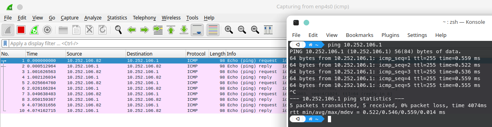

# Praktikum 2 - Identifikasi packet ICMP

## A. Pendahuluan

Untuk keperluan data forensik, kita membutuhkan beberapa alat. Salah satu alat yang digunakan adalah wireshark. Wireshark berfungsi untuk melakukan penangkapan paket yang melewati sebuah jaringan. Paket disini adalah data yang dihasilkan dari enkapsulasi perangkat layer 3.

Metode yang digunakan oleh wireshark adalah semua paket yang melewati sebuah jaringan akan ditangkap informasi layer 3 sampai kebawah. Jadi semua informasi header dan trailer semua paket yang lewat ditangkap secara rinci oleh wireshark.

## B. Cara menggunakan wireshark

Untuk menggunakan wireshark, kita harus memposisikan komputer kita pada jalur yang dilewati oleh paket 

Setelah itu kita buka wireshark yang sudah diinstall sebelumnya, dan kita pilih interface yang merupakan interface yang kita gunakan untuk capture packet.

Jika kita tidak melakukan filtering, maka semua paket yang lewat akan otomatis tercapture oleh wireshark.

## C. Use case pada icmp

Untuk menunjukkan bagian apa saja yang dapat kita analisa pada wireshark, maka kita akan melakukan percobaan sebagai berikut.

1. Persiapkan terminal atau command prompt pada pc anda sendiri, lalu masukkan perintah untuk ping dengan tujuan gateway anda sendiri. 

        ping [ip gateway]

    Seperti pada contoh di bawah ini, saya akan melakukan ping ke ip gateway yang terhubung dengan pc saya.

    

2. Siapkan wireshark lalu tambahkan filter 'icmp' pada kolom filter. Lalu lakukan capture pada interface yang terhubung dengan gateway tersebut.

    

3. Selanjutnya lakukan capture dan jalankan ping tadi selama 3-4 kali

    

4. Setelah itu stop capture dan mari kita lakukan analisa pada paket yang sudah tercapture oleh wireshark

    a. Untuk yang pertama kali mari kita buka paket no 1 dengan info echo (ping) request

    

    Pada paket tersebut, kita dapat melihat beberapa informasi, antara lain
    1. Pada icmp kita dapat melihat beberapa informasi yaitu
    

        a. type icmp nya adalah icmp type 8 yang merupakan icmp request

        b. Data icmp yang dikirimkan dengan isi data random yang memiliki panjang 48 bit
    2. Pada protokol ipv4 kita mendapatkan informasi
    
        a. IP yang digunakan adalah IP versi 4

        b. Total panjang paketnya adalah 84 bit

        c. TTL untuk paket tersebut adalah 64

        d. Protokol yang sedang dikirim adalah ICMP

        e. Source Address nya adalah 10.252.106.82

        f. Destination Address nya adalah 10.252.106.1

    3. Pada protokol selanjutnya yaitu ethernet frame II, kita mendapatkan informasi 
    

        a. NIC yang menjadi tujuan kita memiliki nama Cisco_7a:e4:00

        b. NIC yang merupakan source dari perangkat kita adalah  ASUSTekC_e8:34:28

    4. Pada header frame, kita mendapatkan informasi sebagai berikut
    

        a. Jenis enkapsulasinya adalah Ethernet(1)

## D. Kesimpulan

Kesimpulan dari percobaan ini, kita dapat melakukan analisa terhadap packet yang sudah di capture oleh wireshark dan mendapatkan informasi yang kita butuhkan.