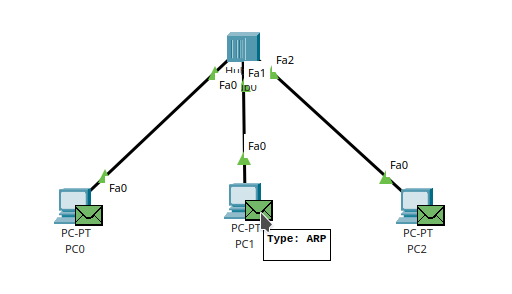

# Praktikum 3 - ARP
## A. Definisi

ARP adalah protokol yang berjalan pada osi layer 2 atau data link layer. Protokol ini digunakan untuk memetakan Logical address (IP Address) ke Physical address (MAC Address). Protokol diterapkan untuk memudahkan pc satu dengan yang lain dalam mencari alamat atau posisi dari pc tujuannya.

## B. rARP
Untuk protokol ini merupakan kebalikan dari ARP. Protokol ini digunakan untuk memetakan Physical Address ke Logical Address.

## C. Cara kerja ARP
Cara kerja ARP memiliki konsep yang sama dari satu perangkat dengan perangkat yang lain. Untuk detailnya adalah sebagai berikut : 
1. Pada awal perangkat tersebut terhubung ke dalam sebuah jaringan, tabel arp yang dimiliki perangkat tersebut akan kosong. Jadi masing-masing perangkat masih belum mengenal satu sama lain. Dari mulai MAC Address, hingga IP Address. Ketika perangkat tersebut sudah mulai melakukan aktifitas, perangkat yang melakukan aktifitas tersebut akan mengirimkan pesan ARP pada seluruh perangkat jaringan dalam satu broadcast domain. Lalu apakah broadcast domain itu? Topik tersebut dapat kita bahas pada sesi selanjutnya.
2. Setelah pesan broadcast dikirimkan, perangkat yang memiliki alamat yang sesuai dengan pesan arp tersebut, akan mengirimkan balasan berupa pesan broadcast lagi yang memberitahukan source address perangkat tersebut, sekaligus menambahkan alamat dari pengirim pesan sebelumnya ke tabel arp nya sendiri.
3. Pesan balasan tersebut akhirnya diterima oleh pengirim asalnya dan tabel arp pun terisi dengan alamat dari perangkat yang membalas pesan tersebut.

## D. Real Case
Untuk membuktikan hal tersebut, mari kita lakukan percobaan berikut ini. Sebelumnya siapkan terlebih dahulu topologi jaringan menggunakan Cisco Packet Tracer dan perangkatnya terdiri dari 3 pc dan sebuah hub untuk menghubungkan ketiga pc tersebut seperti di bawah ini

Setelah topologi tersebut terbentuk, alokasikan ip address untuk masing masing pc dengan ketentuan ip address dari masing-masing perangkat masih dalam 1 network. Untuk konfigurasi yang saya lakukan adalah sebagai berikut

setelah konfigurasi ip address sudah sesuai, aktifkan mode simulation pada packet tracer

Setelah itu reset power cycle device nya

Setelah semua persiapan sudah selesai, mari kita lakukan percobaan berikut ini
1. ping pc0 ke pc1

    Sebelum melakukan ping, mari kita cek terlebih dahulu kondisi tabel arp dari semua perangkat. Ketikkan 
    
        arp -d
    
    pada command prompt masing masing pc

    

    Setelah semua sudah dipastikan kosong tabel arp nya, sekarang kita jalankan terlebih dahulu simulation nya, karena dari capture persiapan setelah power cycle reset semua memiliki pesan arp yang siap dikirim. Pesan arp tersebut merupakan pesan awal yang tidak digunakan untuk mencari perangkat lain.

     

    Untuk mengawali percobaan ini, mari kita lakukan ping terlebih dahulu dari pc0, sebelumnya kita cek tabel arpnya sekali lagi lalu lakukan ping

    

    Pada gambar diatas, dapat kira lihat bahwa ada pesan arp berwarna hijau yang sedang melakukan discover pada broadcast domainnya. Setelah pesan arp tersebut sudah kembali, pc0 baru akan mengirimkan paket icmp ke tujuannya, seperti di bawah ini

    

    Ketika ping sudah selesai dan semua paket icmp kembali, mari kita cek tabel arp pada pc0

    

    Disitu dapat kita lihat bahwa ip address dan mac address dari pc1 telah masuk ke tabel arp pc0. Sebelumnya sudah kita cek bahwa tabel arp pada pc1 masih kosong, apakah sekarang berubah? Mari kita cek bersama-sama

    

    Ternyata pada tabel arp pc1 sudah ditambahkan ip address dan mac address dari pc0. Mari kita lanjut ke percobaan berikutnya

2. ping lagi dari pc0 ke pc1

    Mari kita lakukan percobaan ping yang sama dengan percobaan sebelumnya. Disini kita akan melakukan pemantauan terhadap pesan arp. Apakah pesan arp akan dikirimkan lagi?

    

    Ternyata pesan arp tidak lagi dikirimkan oleh pc0 dan langsung mengirimkan paket icmp. Hal itu karena pc0 tidak perlu melakukan discover lagi terhadap jaringannya sendiri.

3. ping pc1 ke pc0

    Percobaan berikutnya adalah ping dari pc1 dan pc0, proses apakah yang dijalankan pc1 ketika melakukan ping pertama kali ke pc0?

    

    Pada percobaan ini dapat kita lihat bahwa pc1 langsung mengirimkan paket icmp ke pc0 karena ip address dan mac address dari pc0 sudah ada di dalam tabel arp pc1.