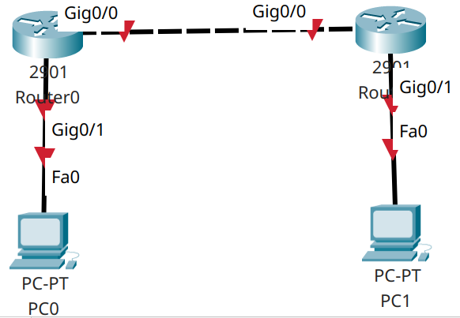
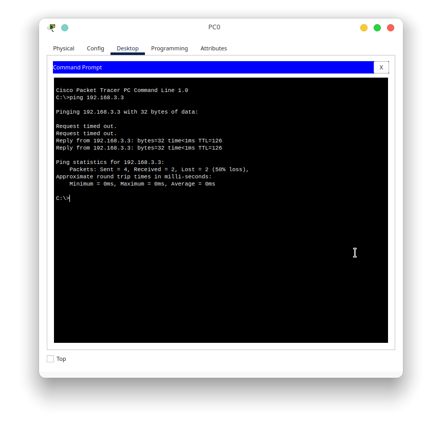
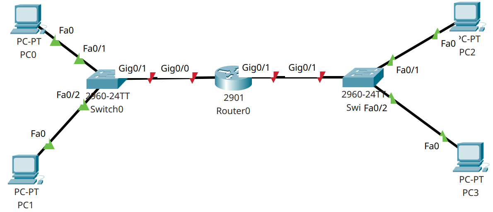
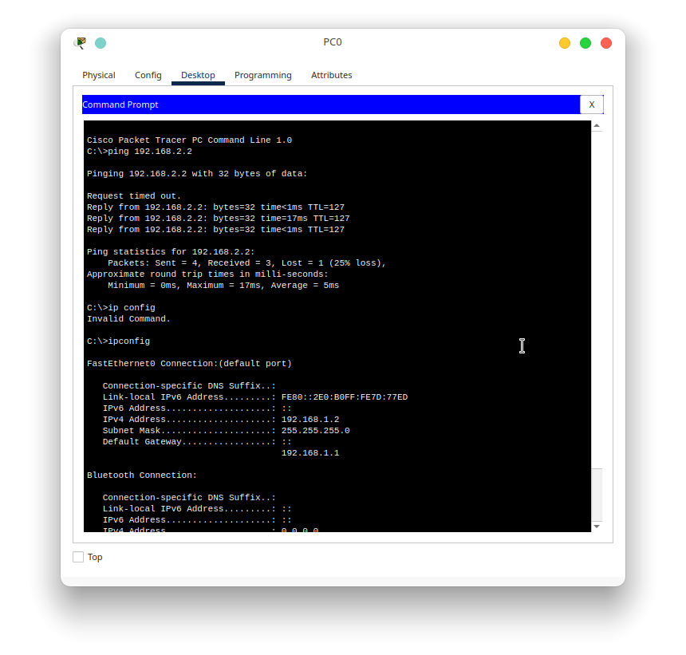
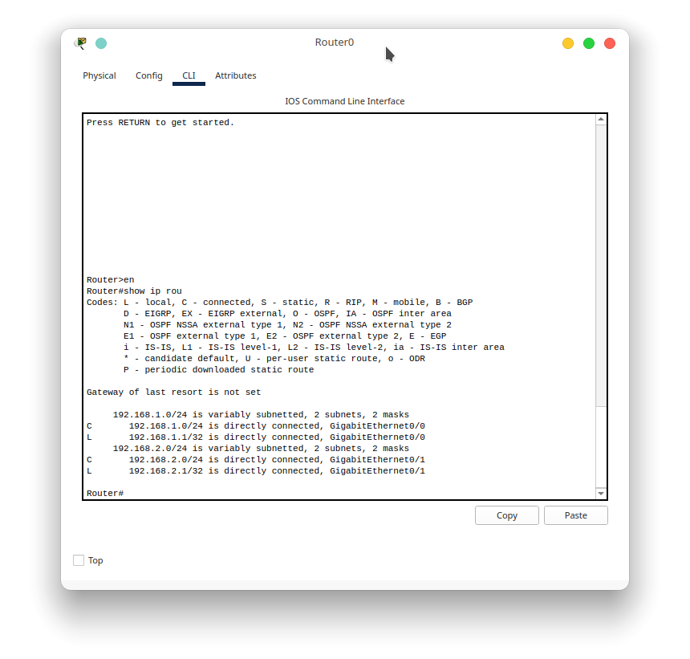

# Praktikum 4 - Static Routing
## A. Pendahuluan
Pada implementasi jaringan menggunakan router, semua perangkat sudah menggunakan enkapsulasi pada layer 3, karena pada layer ini pengalamatan logic sudah bisa diterapkan. Sebagai pendahuluan, mari kita bahas beberapa hal yang merupakan dasar dari layer 3 ini.
## B. IP Address
IP Address adalah bentuk pengalamatan pada layer 3 yang merupakan pengalamatan logic. Pada pengalamatan jenis ini, kita dapat mengubah sesuai dengan logika yang kita kehendaki. Kenapa bisa menyesuaikan dengan logika yang kita kehendaki? Mari kita simak terlebih dahulu beberapa penjelasan di bawah ini.

IP Address terdiri dari 32 bit angka biner untuk IP versi 4 dan 128 bit angka biner untuk IP versi 6. Keduanya memiliki kesamaan yaitu keduanya memiliki 2 bagian yaitu network address dan host address. Network address sendiri digunakan untuk mendefinisikan alamat dari jaringan tersebut dan host address digunakan untuk mendefinisikan alamat dari host itu sendiri. Dari penjelasan sebelumnya kita bisa mengerti bahwa semua yang ada di pengalamatan logic ini bisa dikonfigurasi sesuai kebutuhan.

## C. Routing

Routing adalah salah satu implementasi dari pengalamatan jaringan yang digunakan untuk mencari rute terbaik dari sebuah jalur yang sudah ada. Pada routing ini sendiri memiliki tabel yang berisi alamat tujuan dari jaringan yang kita tuju, lalu jalur mana yang bisa kita pilih apabila kita ingin menempuh jaringan tersebut. Routing sendiri memiliki 2 jenis yaitu
1. Static Routing
2. Dynamic Routing

Perbedaan dari keduanya hanya pada penerapan tabel routingnya. Kalau kita menggunakan static routing, kita harus memasukkan semua routing tersebut pada tabel secara manual. Sedangkan jika kita menggunakan dynamic routing, semua input pada tabel dapat kita automasi sesuai dengan jenis dynamic routingnya.

## D. Percobaan 1 - Static Routing

Pada percobaan ini, kita akan melakukan implementasi dari salah satu jenis routing yaitu static routing. Sebelumnya kita persiapkan terlebih dahulu topologi seperti di bawah ini

Untuk alokasi ip kita konfigurasikan seperti di bawah ini 

|Perangkat|Interface|IP Address     |Gateway        |
|-        |-        |-              |-              |
|PC0      |fa0      |192.168.1.2/24 |192.168.1.1    |
|PC1      |fa0      |192.168.3.3/24 |192.168.3.2    |
|Router0  |Gig0/1   |192.168.1.1/24 |               |
|         |Gig0/0   |192.168.2.1/24 |               |
|Router1  |Gig0/0   |192.168.2.2/24 |               |
|         |Gig0/1   |192.168.3.2/24 |               |

Setelah semua perangkat sudah kita konfigurasikan alamat IP nya, mari kita konfigurasikan juga routing staticnya. Untuk mengkonfigurasikan routing staticnya dengan konfigurasi sebagai berikut

Router0

    ip route 192.168.3.0 255.255.255.0 192.168.2.2

Router1

    ip route 192.168.1.0 255.255.255.0 192.168.2.1

Konfigurasi tersebut digunakan untuk menentukan rute yang bisa dilalui apabila sebuah paket mencari tujuan sesuai dengan jaringan yang sudah didefinisikan.

Setelah semua sudah dikonfigurasi, mari kita lakukan percobaan ping dari pc0 ke pc1

Pada capture diatas, dapat kita lihat bahwa terjadi 2 kali RTO pada ping pertama dan kedua karena ping pertama dan kedua terjadi arp pada broadcast domain antara pc0 dengan router0 dan router0 dan router1. Pada ping selanjutnya baru terkoneksi secara langsung karena proses arp telah selesai dilakukan.

## E. Percobaan 2 - 1 router 2 jaringan

Untuk percobaan selanjutnya adalah penerapan dari 2 jaringan yang berbeda namun terhubung ke sebuah router yang sama. Untuk gambaran topologinya adalah sebagai berikut

Untuk alokasi ip kita konfigurasikan seperti di bawah ini 

|Perangkat|Interface|IP Address     |Gateway        |
|-        |-        |-              |-              |
|PC0      |fa0      |192.168.1.2/24 |192.168.1.1    |
|PC1      |fa0      |192.168.1.3/24 |192.168.1.1    |
|PC2      |fa0      |192.168.2.2/24 |192.168.2.1    |
|PC3      |fa0      |192.168.2.3/24 |192.168.2.1    |
|Router0  |Gig0/1   |192.168.1.1/24 |               |
|         |Gig0/0   |192.168.2.1/24 |               |

Setelah semua sudah dikonfigurasi, sekarang kita coba test ping dari pc0 ke pc 2 yang sudah berbeda network

Dan ternyata pc0 dan pc2 sudah terhubung meskipun kita belum menambahkan routing secara manual ke routernya. Hal itu dikarenakan ketika kita menambahkan ip ke router kita, maka secara otomatis itu juga menambahkan routing ke jaringan tersebut yang directly connected atau terhubung secara langsung. Hal itu bisa kita lihat pada capture dibawah ini 

Jika kita menghapus ip router kita pada interface tersebut, maka routing ke jaringan tersebut juga akan ikut terhapus.