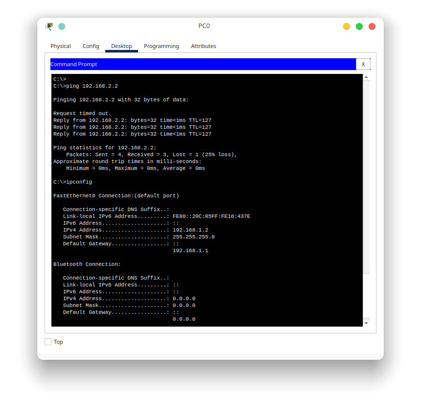
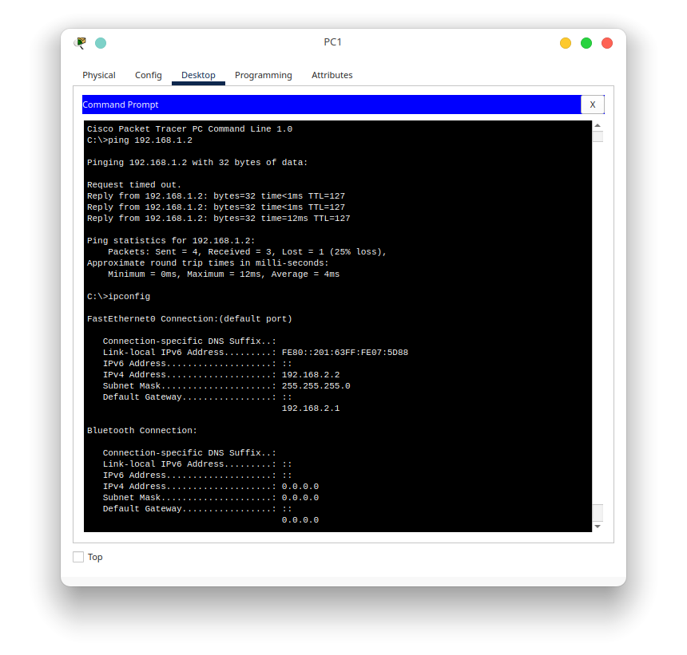

# Praktikum 5 - Intervlan

## A. Intervlan

Intervlan merupakan metode untuk menyalurkan vlan dari sebuah router. Metode ini digunakan untuk menghubungkan beberapa jaringan yang berbeda dan terhubung dengan sebuah router.

## B. Jenis Intervlan

Metode router untuk menghubungkan interface vlan ada beberapa jenis, antara lain
1. Traditional Intervlan

    Metode yang pertama kali digunakan adalah metode tradisional dari intervlan ini sendiri. Implementasi pertama dari intervlan ini menggunakan sebuah dedicated interface untuk menghubungkan sebuah jalur vlan. Untuk gambaran dari traditional intervlan adalah sebagai berikut

    

    Pada topologi tersebut dapat kita lihat bahwa untuk vlan 10 dan vlan 20 memiliki media sendiri dalam menghubungkan kedua vlan tersebut. Untuk vlan 10 menggunakan port gi 0/0 pada router dan untuk vlan 20 menggunakan port gi 0/1 pada router.
2. Router-On-Stick

    Seiring berjalannya waktu, metode implementasi intervlan juga berkembang. Metode yang terbaru dan paling sering digunakan sekarang adalah Router-On-Stick. Apa itu Router-On-Stick? Router-On-Stick adalah metode menyalurkan vlan menggunakan sebuah jalur saja. Jadi masing-masing vlan tidak menggunakan sebuah dedicated interface untuk menyalurkannya dari sebuah router. Contoh implementasinya dapat kita lihat pada topologi berikut

    

    Pada topologi diatas dapat kita lihat bahwa router hanya menggunakan sebuah kabel saja yang terhubung dengan switch. Kedua jalur vlan 10 dan vlan 20 disambungkan dengan menggunakan interface gi 0/1 pada router. 

## C. Traditional Intervlan vs RoS Intervlan

Dari penjelasan diatas sebenarnya kita dapat mengetahui secara langsung apa saja perbedaan dari kedua jenis metode tersebut. Karena pada dasarnya fungsi dari vlan adalah membuat switch agar memiliki lebih dari 1 broadcast domain, maka solusi secara langsung yang dapat diimplementasikan adalah menggunakan beberapa interface terpisah dari router secara langsung. Kenapa vlan dapat membuat broadcast domain baru? coba simak penjelasan tentang vlan terlebih dahulu. Dari implementasi pertama tentang intervlan ternyata ada beberapa hal yang mengganggu perkembangan dari intervlan sendiri, antara lain
1. Biaya yang dikeluarkan terlalu banyak

    Karena satu jalur vlan membutuhkan satu jalur sendiri untuk terhubung dengan switch, maka dibutuhkan lebih banyak interface dan kabel untuk menghubungkan banyak vlan. Hal itu dapat menyebabkan membengkaknya biaya untuk membuat vlan itu sendiri. Mulai dari penambahan interface pada router, hingga biaya dari media penghubung atau kabel itu sendiri.

2. Konfigurasi yang terlalu kompleks

    Dari topologi tadi dapat kita lihat bahwa masing masing jalur vlan memiliki dedicated interface untuk terhubung dengan switch. Hal itu menyebabkan konfigurasi pada switch jadi terlalu kompleks karena masing masing port yang terhubung harus dikonfigurasi sesuai dengan vlan nya.

Hal itu memicu perkembangan metode Intervlan untuk menggunakan fitur trunk pada vlan. Trunk memungkinkan kita melewatkan beberapa vlan pada satu jalur. Jadi yang sebelumnya harus dedicated 1 port untuk 1 vlan, bisa kita sesuaikan agar 1 port dapat menghandle beberapa vlan. Untuk tabel perbedaan dari kedua metode tersebut, sudah saya rangkum sebagai berikut

|Traditional Intervlan|Router-On-Stick Intervlan|
|-|-|
|Biaya lebih mahal|Biaya lebih murah|
|Konfigurasi terlalu kompleks| Konfigurasi lebih ringkas|
|Bandwith lebih terjamin|Bandwith kurang terjamin karena satu jalur digunakan bersama-sama|

## D. Konfigurasi Intervlan

Dalam penerapan intervlan, kita membutuhkan pengetahuan dasar tentang vlan terlebih dahulu. Setelah kita memahami bagaimana vlan bekerja, maka intervlan mudah dipahami dan tidak terlalu rumit. Untuk percobaan ini kita akan menggunakan konfigurasi sebagai berikut

|Device|Interface|IP Address|Gateway|
|-|-|-|-|
|Router0|vlan10|192.168.1.1/24||
||vlan20|192.168.2.1/24||
|pc0|fa0/1|192.168.1.2/24|192.168.1.1|
|pc1|fa0/1|192.168.2.2/24|192.168.2.1|

Dari konfigurasi ip tersebut, mari kita coba implementasi pada kedua metode intervlan tersebut. Sebelumnya kita pastikan dulu ip pada pc0 dan pc1 sudah terkonfigurasi dengan baik. 

Setelah ip dari kedua pc sudah terkonfigurasi dengan baik, mari kita menuju ke metode traditional terlebih dahulu

1. Traditional intervlan

    Pastikan topologi sudah sesuai dengan gambar berikut

    

    Pada topologi diatas dapat kita pastikan bahwa vlan10 akan dilewatkan melalui port gi0/0 pada router dan gi0/1 pada switch, sedangkan vlan20 akan dilewatkan melalui port gi0/1 pada router dan gi0/2 pada switch. Mari kita tambahkan konfigurasi berikut pada router

        # configure terminal
        # interface gi 0/0
        # ip address 192.168.1.1 255.255.255.0
        # no shutdown
        # interface gi 0/1
        # ip address 192.168.2.1 255.255.255.0
        # no shutdown
        # exit
        # exit

    Untuk selanjutnya mari kita konfigurasi swichnya agar bisa menghubungkan jaringan dari router ke pc tujuan. PC0 terhubung dengan switch pada port fa0/1 dan PC1 terhubung dengan switch pada port fa0/2. Dan berikut ini adalah konfigurasi untuk switch

        # configure terminal
        # interface gi0/1
        # switchport mode access
        # switchport access vlan 10
        # no shutdown
        # interface gi0/2
        # switchport mode access
        # switchport access vlan 20
        # no shutdown
        # interface fa0/1
        # switchport mode access
        # switchport access vlan 10
        # no shutdown
        # interface fa0/2
        # switchport mode access
        # switchport access vlan 20
        # no shutdown
        # exit
        # exit
    
    Setelah itu kita coba lakukan tes ping untuk PC0 ke PC1

    

2. Router-On-Stick intervlan

    Untuk metode selanjutnya adalah RoS intervlan. Untuk implementasi kali ini, pastikan topologi udh sesuai dengan yang di bawah ini.

    

    Sedikit penjelasan dari topologi diatas. Router dengan switch dihubungkan oleh kabel yang melalui interface gi0/1 dari router dan gi0/1 dari switch. Kabel tersebut akan mengalirkan vlan 10 dan vlan 20 pada topologi tersebut. Lalu dari switch tersebut akan mengalirkan vlan 10 ke interface fa0/1 dan vlan 20 ke fa0/2. Router pada metode RoS ini akan dikonfigurasi sub interface nya untuk mengalirkan vlan dan mengatur enkapsulasi untuk vlan 10 dan vlan 20. Sedangkan pada switch, dikonfigurasi agar bisa menangkap hasil konfigurasi tersebut menggunakan trunk. Untuk implementasi pada router adalah sebagai berikut

        # configure terminal
        # interface gi0/1.10
        # encapsulation dot1q 10
        # ip address 192.168.1.1 255.255.255.0
        # no shutdown
        # interface gi0/1.20
        # encapsulation dot1q 20
        # ip address 192.168.2.1 255.255.255.0
        # no shutdown
        # interface gi0/1
        # no shutdown
        # exit
        # exit

    Setelah itu kita konfigurasi pada switchnya.

        # configure terminal
        # interface gi0/1
        # switchport mode trunk
        # switchport trunk allow vlan 10,20
        # no shutdown
        # interface fa0/1
        # switchport mode access
        # switchport access vlan 10
        # no shutdown
        # interface fa0/2
        # switchport mode access
        # switchport access vlan 20
        # exit
        # exit

    Setelah itu kita akan melakukan tes ping dari PC1 ke PC0

    
    