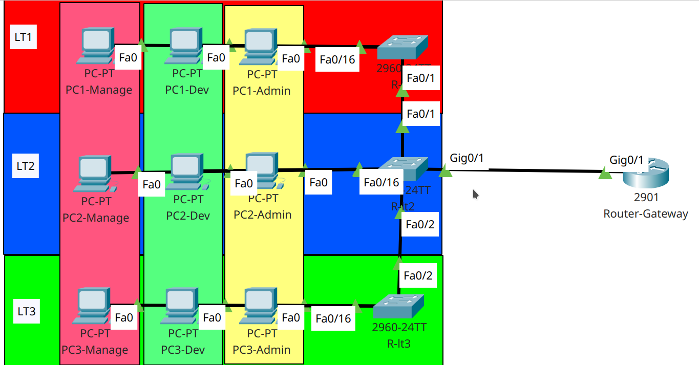

# VLAN Trunk and Access
## A. VLAN
Vlan adalah salah satu metode untuk mengalirkan beberapa jalur logic pada sebuah jalur fisik. Dengan adanya vlan, kita dapat melewatkan beberapa segmen jaringan tanpa harus khawatir dengan adanya tabrakan traffic yang lewat. Semua traffic yang lewat dienkapsulasi ulang pada layer 2 dengan menggunakan perubahan mac address sebanyak 2 byte yang digunakan untuk menambahkan tag vlan id. 

## B. Jenis VLAN
Dalam implementasinya, vlan memiliki beberapa jenis. Jenis ini mewakili penggunakan vlan itu sendiri. Jenis-jenis tersebut antara lain

1. Default VLAN

    Vlan ini merupakan vlan yang dijadikan pengaturan vlan dalam suatu perangkat switch manageable layer 2. Semua port yang tidak dikonfigurasi vlan nya akan terdaftar sebagai pengguna vlan ini. Default vlan umumnya yang digunakan adalah vlan 1.
2. Data VLAN

    Vlan ini merupakan vlan yang dikonfigurasi sebagai vlan yang sebenarnya. Dari vlan ini kita dapat membentuk segmen-segmen jaringan baru untuk mengalirkan data sesuai dengan segmen yang telah kita buat. Kita dapat membuat vlan ini dari vlan id 2-1001 kecuali 99. Kenapa vlan 99 tidak bisa digunakan? kita akan membahasnya nanti.
3. Voice VLAN

    Jenis vlan selanjutnya adalah Voice vlan. Vlan dengan jenis ini digunakan untuk mengalirkan data berupa voice atau digunakan untuk memanfaatkan teknologi VOIP (Voice over IP). Jadi traffic yang melewati vlan ini dikhususkan untuk data dalam bentuk voice saja. Untuk range yang bisa digunakan oleh vlan ini sama dengan Data vlan.
4. Management VLAN

    Vlan ini digunakan untuk melakukan management perangkat yang menggunakan vlan. Aktifitas remote, pemantauan traffic, dan memantau data sensitif menggunakan vlan jenis ini. Umumnya vlan ini dibatasi aksesnya untuk meningkatkan keamanan dari perangkat tersebut.
5. Native VLAN

    Vlan jenis terakhir adalah Native vlan. Vlan jenis ini digunakan untuk mengalirkan data yang tidak ikut terubah vlan id nya atau tidak dikenai vlan pada jalur trunk. Jadi perangkat yang tidak memiliki support terhadap vlan masih bisa dialiri vlan namun tidak dapat melakukan untag pada traffic yang diterima.

## C. Trunk and Access
Koneksi vlan memiliki 2 jenis, yaitu trunk dan access. Trunk adalah koneksi vlan yang digunakan untuk melewatkan beberapa vlan pada sebuah jalur, atau yang bisa kita sebut dengan tagging pada layer 2. Untuk koneksi access merupakan koneksi yang digunakan untuk melewatkan sebuah vlan saja dengan kondisi layer 2 yang sama seperti port aslinya.

Koneksi Trunk umumnya digunakan antar perangkat jaringan yang bukan end device, sedangkan koneksi access bisa digunakan untuk menghubungkan perangkat end device maupun perangkat seperti switch atau router sesuai dengan kebutuhannya.

## D. Vlan Access and Trunking practice
Sekarang kita akan mencoba melakukan konfigurasi vlan trunk dan access. Untuk melakukan percobaan tersebut, kita akan menggunakan studi kasus bangunan yang memiliki banyak lantai. Dalam sebuah gedung memiliki manajemen jaringan yang memungkinkan semua departemen dapat terhubung sesuai dengan departemen nya sendiri. Pada kondisi lapangan, masing-masing departemen ditempatkan pada lantai yang terpisah, namun mereka tetap terhubung pada segmen jaringan yang sama pada tiap departemen. Kita diinstruksikan untuk mengkonfigurasi perangkat yang sudah terpasang dengan kriteria sebagai berikut

Masing-masing lantai memiliki sebuah switch yang digunakan untuk menghubungkan semua komputer pada lantai tersebut. Masing-masing lantai memiliki 5 komputer untuk tiap divisi. Sebuah router diletakkan di lantai 2 dan terhubung dengan switch pada lantai tersebut. Router ini digunakan untuk memberikan akses komunikasi antar divisi. Divisi nya antara lain

|Nama Divisi|Segmen IP|
|-|-|
|Admin|192.168.1.0/24|
|Developer|192.168.2.0/24|
|Management|192.168.3.0/24|

Konfigurasi switch pada masing-masing lantai untuk terhubung pada komputer departemen juga sama. Alokasinya ada di tabel berikut

|Divisi|Vlan ID|Alokasi port|
|-|-|-|
|Admin|10|Fa0/6 - Fa0/10|
|Developer|20|Fa0/11 - Fa0/15|
|Management|30|Fa0/16 - Fa0/20|

Switch pada lt1 menggunakan port fa0/1 untuk terhubung dengan Switch pada lt2. Switch pada lt2 menggunakan port Gi0/1 untuk terhubung ke Router utama dan port fa0/2 untuk terhubung ke Switch pada lt3.

Untuk mendukung semua konfigurasi tersebut, maka kita akan mengimplementasikan perintah berikut

Switch Lt1

    hostname Sw-LT1
    !
    vlan 10
     name admin
    !
    vlan 20
     name developer
    !
    vlan 30
     name management
    !
    interface FastEthernet0/1
     switchport trunk allowed vlan 10,20,30
     switchport mode trunk
    !
    interface FastEthernet0/6
     switchport access vlan 10
     switchport mode access
    !
    interface FastEthernet0/7
     switchport access vlan 10
     switchport mode access
    !
    interface FastEthernet0/8
     switchport access vlan 10
     switchport mode access
    !
    interface FastEthernet0/9
     switchport access vlan 10
     switchport mode access
    !
    interface FastEthernet0/10
     switchport access vlan 10
     switchport mode access
    !
    interface FastEthernet0/11
     switchport access vlan 20
     switchport mode access
    !
    interface FastEthernet0/12
     switchport access vlan 20
     switchport mode access
    !
    interface FastEthernet0/13
     switchport access vlan 20
     switchport mode access
    !
    interface FastEthernet0/14
     switchport access vlan 20
     switchport mode access
    !
    interface FastEthernet0/15
     switchport access vlan 20
     switchport mode access
    !
    interface FastEthernet0/16
     switchport access vlan 30
     switchport mode access
    !
    interface FastEthernet0/17
     switchport access vlan 30
     switchport mode access
    !
    interface FastEthernet0/18
     switchport access vlan 30
     switchport mode access
    !
    interface FastEthernet0/19
     switchport access vlan 30
     switchport mode access
    !
    interface FastEthernet0/20
     switchport access vlan 30
     switchport mode access
    !
Switch Lt2

    hostname Sw-LT2
    !
    vlan 10
     name admin
    !
    vlan 20
     name developer
    !
    vlan 30
     name management
    !
    interface FastEthernet0/1
     switchport trunk allowed vlan 10,20,30
     switchport mode trunk
    !
    interface FastEthernet0/2
     switchport trunk allowed vlan 10,20,30
     switchport mode trunk
    !
    interface FastEthernet0/6
     switchport access vlan 10
     switchport mode access
    !
    interface FastEthernet0/7
     switchport access vlan 10
     switchport mode access
    !
    interface FastEthernet0/8
     switchport access vlan 10
     switchport mode access
    !
    interface FastEthernet0/9
     switchport access vlan 10
     switchport mode access
    !
    interface FastEthernet0/10
     switchport access vlan 10
     switchport mode access
    !
    interface FastEthernet0/11
     switchport access vlan 20
     switchport mode access
    !
    interface FastEthernet0/12
     switchport access vlan 20
     switchport mode access
    !
    interface FastEthernet0/13
     switchport access vlan 20
     switchport mode access
    !
    interface FastEthernet0/14
     switchport access vlan 20
     switchport mode access
    !
    interface FastEthernet0/15
     switchport access vlan 20
     switchport mode access
    !
    interface FastEthernet0/16
     switchport access vlan 30
     switchport mode access
    !
    interface FastEthernet0/17
     switchport access vlan 30
     switchport mode access
    !
    interface FastEthernet0/18
     switchport access vlan 30
     switchport mode access
    !
    interface FastEthernet0/19
     switchport access vlan 30
     switchport mode access
    !
    interface FastEthernet0/20
     switchport access vlan 30
     switchport mode access
    !
    interface GigabitEthernet0/1
     switchport trunk allowed vlan 10,20,30
     switchport mode trunk
    !
Switch Lt3

    hostname Sw-LT3
    !
    vlan 10
     name admin
    !
    vlan 20
     name developer
    !
    vlan 30
     name management
    !
    interface FastEthernet0/2
     switchport trunk allowed vlan 10,20,30
     switchport mode trunk
    !
    interface FastEthernet0/6
     switchport access vlan 10
     switchport mode access
    !
    interface FastEthernet0/7
     switchport access vlan 10
     switchport mode access
    !
    interface FastEthernet0/8
     switchport access vlan 10
     switchport mode access
    !
    interface FastEthernet0/9
     switchport access vlan 10
     switchport mode access
    !
    interface FastEthernet0/10
     switchport access vlan 10
     switchport mode access
    !
    interface FastEthernet0/11
     switchport access vlan 20
     switchport mode access
    !
    interface FastEthernet0/12
     switchport access vlan 20
     switchport mode access
    !
    interface FastEthernet0/13
     switchport access vlan 20
     switchport mode access
    !
    interface FastEthernet0/14
     switchport access vlan 20
     switchport mode access
    !
    interface FastEthernet0/15
     switchport access vlan 20
     switchport mode access
    !
    interface FastEthernet0/16
     switchport access vlan 30
     switchport mode access
    !
    interface FastEthernet0/17
     switchport access vlan 30
     switchport mode access
    !
    interface FastEthernet0/18
     switchport access vlan 30
     switchport mode access
    !
    interface FastEthernet0/19
     switchport access vlan 30
     switchport mode access
    !
    interface FastEthernet0/20
     switchport access vlan 30
     switchport mode access
    !

Sedikit ringkasan tentang apa saja yang dikonfigurasi pada switch diatas yang pertama adalah konfigurasi vlan dan nama vlan pada switch tersebut. Untuk vlan 10 karena dimiliki oleh departemen admin, maka nama vlan tersebut adalah admin, begitu pula dengan yang lain. Untuk masing-masing port yang sudah memiliki alokasi langsung dikonfigurasi sesuai dengan role nya. Untuk port trunk dialokasikan untuk melewatkan beberapa vlan yang telah dikonfigurasi dan melimitasi vlan apa saja yang lewat. untuk port access maka dikonfigurasi port tersebut akan melakukan access terhadap vlan id berapa.
Selanjutnya adalah konfigurasi pada router. Router disini digunakan untuk melakukan routing secara langsung pada jaringan yang ada di dalamnya, dan juga router ini berlaku sebagai DHCP server untuk semua client agar client bisa langsung terhubung tanpa dikonfigurasikan IP nya secara manual. Untuk konfigurasinya adalah sebagai berikut

    hostname R-Gate
    !
    ip dhcp excluded-address 192.168.1.1
    ip dhcp excluded-address 192.168.2.1
    ip dhcp excluded-address 192.168.3.1
    !
    ip dhcp pool pooladmin
     network 192.168.1.0 255.255.255.0
     default-router 192.168.1.1
     dns-server 192.168.1.1
    ip dhcp pool pooldev
     network 192.168.2.0 255.255.255.0
     default-router 192.168.2.1
     dns-server 192.168.2.1
    ip dhcp pool poolmanage
     network 192.168.3.0 255.255.255.0
     default-router 192.168.3.1
     dns-server 192.168.3.1
    !
    interface GigabitEthernet0/0
     no ip address
     duplex auto
     speed auto
     shutdown
    !
    interface GigabitEthernet0/1
     no ip address
     duplex auto
     speed auto
    !
    interface GigabitEthernet0/1.10
     encapsulation dot1Q 10
     ip address 192.168.1.1 255.255.255.0
    !
    interface GigabitEthernet0/1.20
     encapsulation dot1Q 20
     ip address 192.168.2.1 255.255.255.0
    !
    interface GigabitEthernet0/1.30
     encapsulation dot1Q 30
     ip address 192.168.3.1 255.255.255.0
    !

Setelah semua konfigurasi telah ditetapkan, mari kita coba lakukan pengetesan pada salah satu pc

Tes dhcp

Tes ping 1 departemen dan berbeda departemen

Sekian dari penjelasan saya, semoga bermanfaat bagi kita semua.