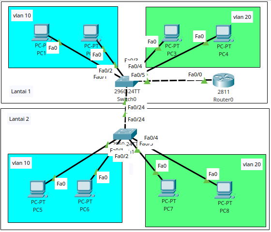
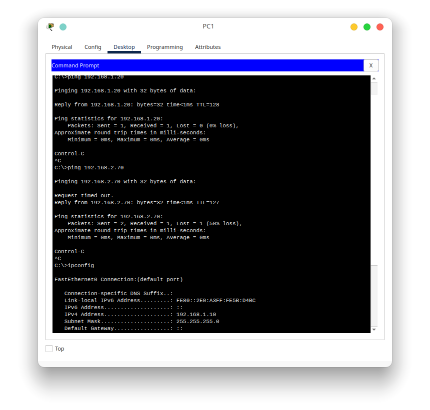

# POST TEST 1 - Router on Stick
## A. Pendahuluan
Pada post test ini ada beberapa hal yang harus dikonfigurasikan. Namun sebelum masuk ke konfigurasi, alangkah baiknya kita coba simak soal post testnya terlebih dahulu
## B. Soal
Anda adalah seorang network engineer yang diinstruksikan oleh atasan anda untuk mengkonfigurasi router dan switch di kantor dengan topologi dan ketentuan sebagai berikut

Semua perangkat pada topologi tersebut sudah ada pemetaan konfigurasi ip seperti pada tabel berikut

|No|Device name|Interface name|IP Address/subnet mask|VLAN|Floor|Additional Information|
|-|-|-|-|-|-|-|
|1|Router 0|fa0/0.10|192.168.1.1/24|trunk to Switch0|1|Router on stick|
|||fa0/0.20|192.168.2.1/24|trunk to Switch0|1|Router on stick|
|2|Switch0|fa0/1||10|1||
|||fa0/2||10|1||
|||fa0/3||20|1||
|||fa0/4||20|1||
|||fa0/5||trunk to Router0|1||
|||fa0/24||trunk to Switch1|1||
|3|PC1|fa0|192.168.1.10/24|10|1|default gw : 192.168.1.1|
||PC2|fa0|192.168.1.20/24|10|1|default gw : 192.168.1.1|
||PC3|fa0|192.168.2.10/24|20|1|default gw : 192.168.2.1|
||PC4|fa0|192.168.2.20/24|20|1|default gw : 192.168.2.1|
|4|Switch1|fa0/1||10|2||
|||fa0/2||10|2||
|||fa0/3||20|2||
|||fa0/4||20|2||
|||fa0/24||trunk to Switch0|2||
|5|PC5|fa0|192.168.1.50/24|10|2|default gw : 192.168.1.1|
||PC6|fa0|192.168.1.60/24|10|2|default gw : 192.168.1.1|
||PC7|fa0|192.168.2.70/24|20|2|default gw : 192.168.2.1|
||PC8|fa0|192.168.2.80/24|20|2|default gw : 192.168.2.1|

## C. Analisa
Ada beberapa hasil dari analisa yang didapatkan ketika menyimak soal tersebut yaitu
1. Konfigurasi router dengan switch adalah router on stick
2. Jaringan tersebut memiliki 2 buah vlan yang mana vlan tersebut ada di lantai 1 dan lantai 2
3. Konfigurasi router on stick digunakan untuk menghubungkan 2 jaringan vlan tersebut agar masih bisa terkoneksi satu sama lain

Dari analisa tersebut, maka ada beberapa konfigurasi yang diterapkan seperti di bawah ini

## D. Konfigurasi
### 1). Router0
    !
    hostname Router0
    !
    interface FastEthernet0/0
    no ip address
    duplex auto
    speed auto
    no shutdown
    !
    interface FastEthernet0/0.10
    encapsulation dot1Q 10
    ip address 192.168.1.1 255.255.255.0
    !
    interface FastEthernet0/0.20
    encapsulation dot1Q 20
    ip address 192.168.2.1 255.255.255.0
    !
### 2). Switch0
    !
    hostname Switch0
    !
    interface FastEthernet0/1
    switchport access vlan 10
    switchport mode access
    !
    interface FastEthernet0/2
    switchport access vlan 10
    switchport mode access
    !
    interface FastEthernet0/3
    switchport access vlan 20
    switchport mode access
    !
    interface FastEthernet0/4
    switchport access vlan 20
    switchport mode access
    !
    interface FastEthernet0/5
    switchport trunk allowed vlan 10,20
    switchport mode trunk
    !
    interface FastEthernet0/24
    switchport trunk allowed vlan 10,20
    switchport mode trunk
    !
### 3). Switch1
    !
    hostname Switch1
    !
    interface FastEthernet0/1
    switchport access vlan 10
    switchport mode access
    !
    interface FastEthernet0/2
    switchport access vlan 10
    switchport mode access
    !
    interface FastEthernet0/3
    switchport access vlan 20
    switchport mode access
    !
    interface FastEthernet0/4
    switchport access vlan 20
    switchport mode access
    !
    interface FastEthernet0/24
    switchport trunk allowed vlan 10,20
    switchport mode trunk
    !

## E). Hasil konfigurasi
Setelah konfigurasi tersebut diterapkan, maka hasilnya adalah sebagai berikut

