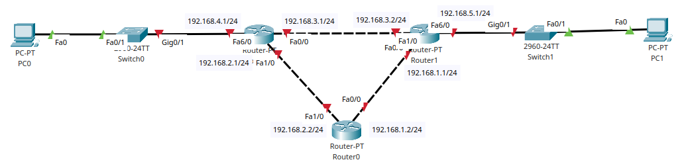
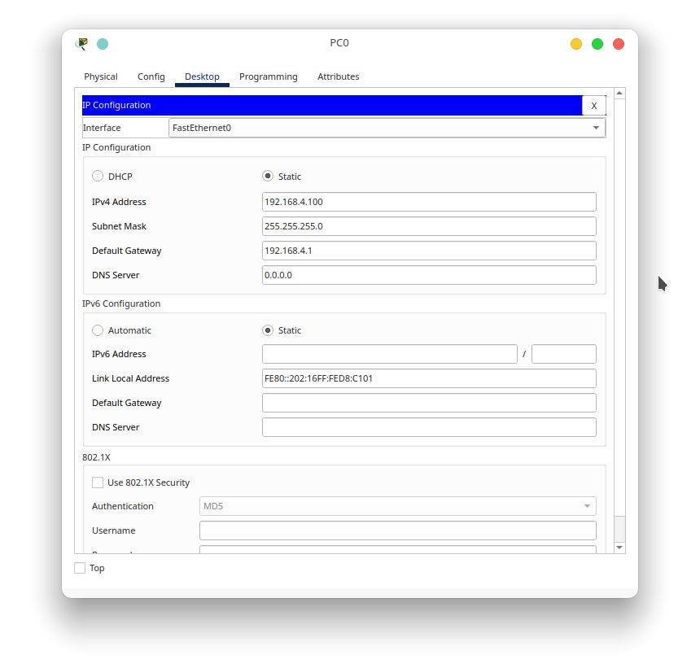
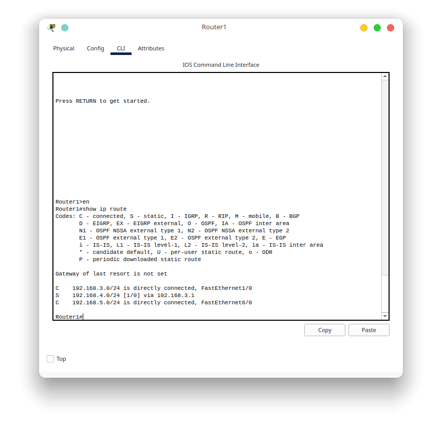
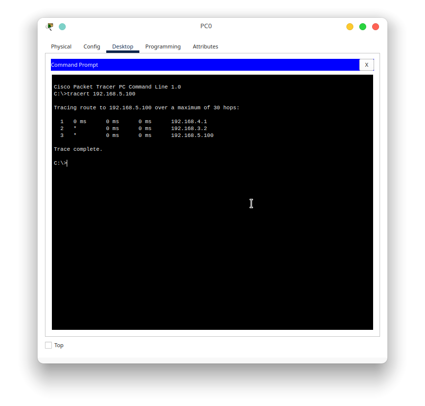
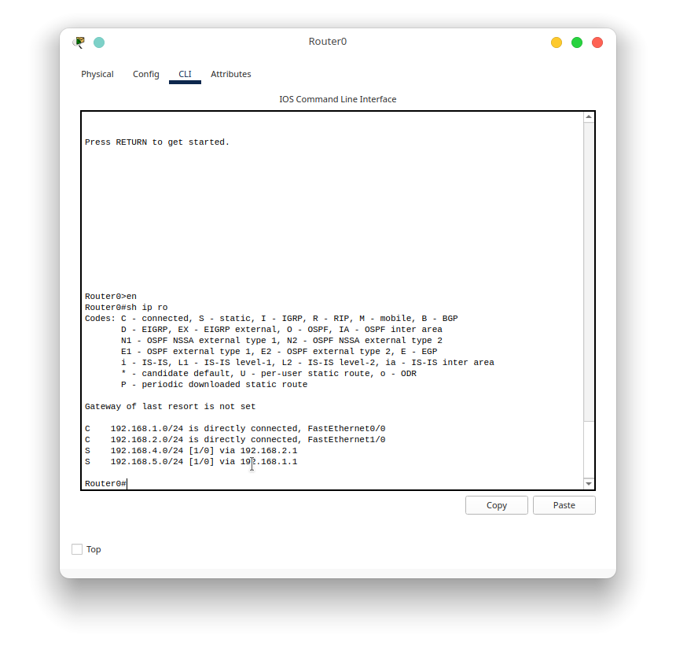
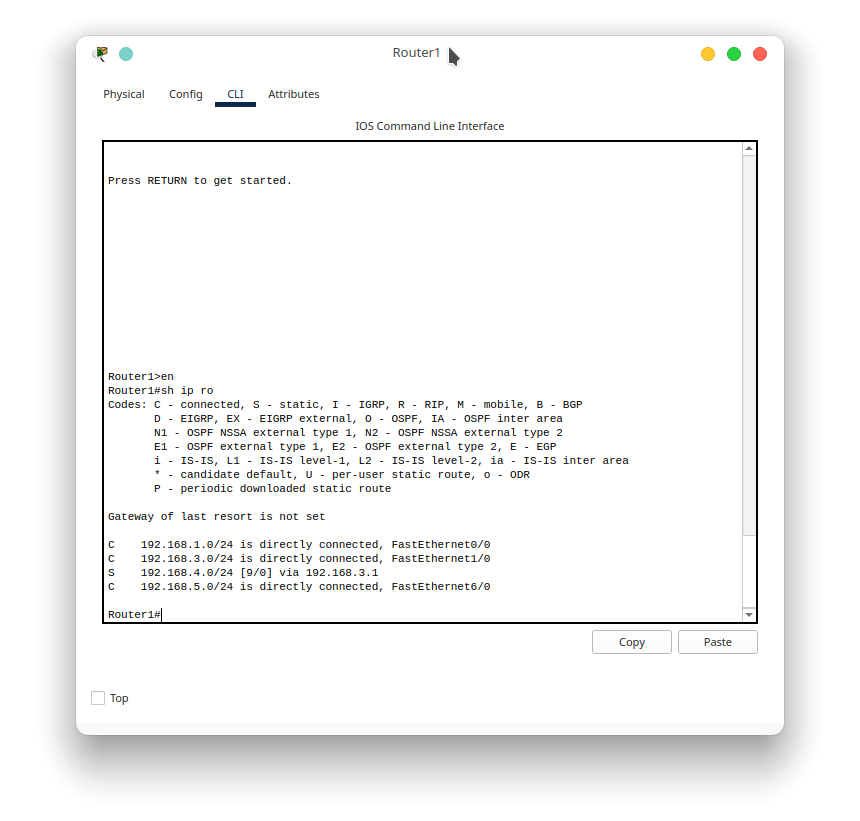
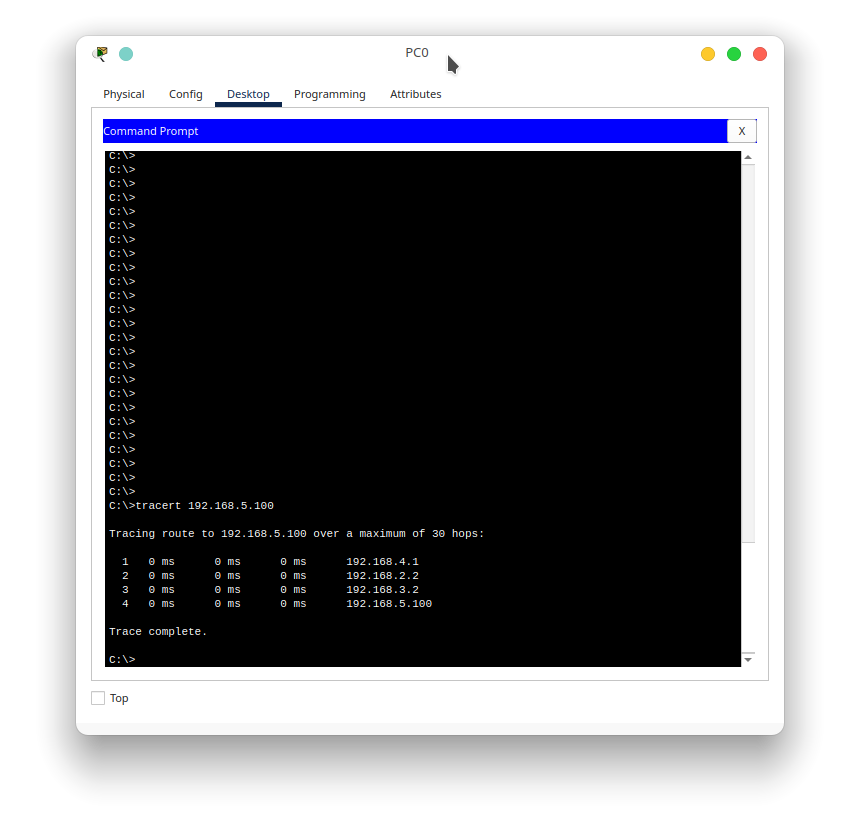
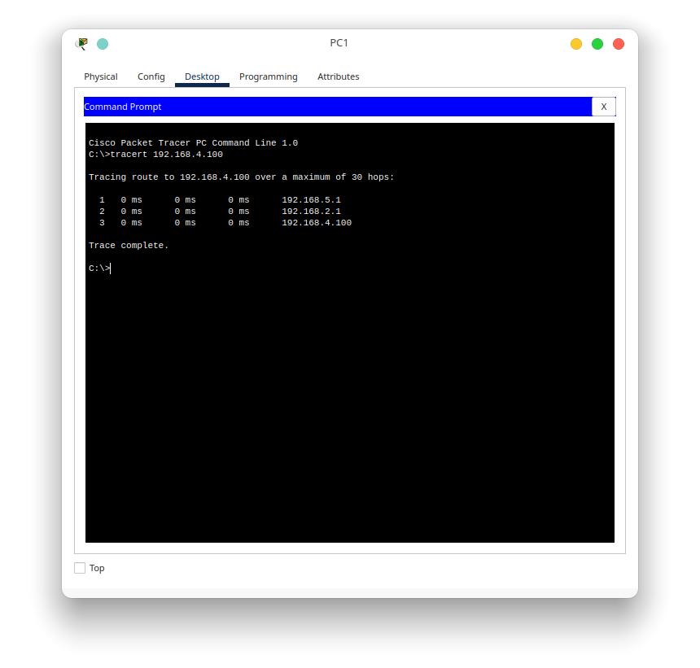

# Praktikum 7 - Static Routing
## A. Pendahuluan
Sebelumnya kita sudah pernah membahas tentang static routing. Singkatnya, static routing merupakan metode pencatatan rute pada tabel routing menggunakan cara manual. Rute untuk menuju ke sebuah jaringan atau sebuah host bisa ada lebih dari 1. Maka dalam tabel routing, juga terdapat 1 parameter lagi yaitu distance. Distance digunakan dalam penghitungan metric dari sebuah jalur. Metric disini adalah rangkaian perhitungan yang digunakan untuk memilih prioritas jalur yang bisa dipilih oleh paket. Parameter dalam menghitung metric ada beberapa hal, namun yang paling berpengaruh adalah distance. Dalam praktikum ini, kita akan mencoba routing yang dikonfigurasikan dengan jumlah distance yang berbeda.

## B. Persiapan topologi
Untuk melakukan percobaan, mari kita bentuk terlebih dahulu topologi seperti di bawah ini

Dalam topologi tersebut, dapat kita lihat bahwa jaringan yang sebelah kiri memiliki ip network 192.168.4.0/24, untuk yang sebelah kanan memiliki network 192.168.5.0/24. Untuk menghubungkan kedua network tersebut, terdapat 3 buah router yang terhubung seperti topologi ring. Dari topologi tersebut kita akan mencoba
3 buah percobaan berikut
1. Konfigurasi default untuk menghubungkan jaringan 4.0 dan 5.0 menggunakan Router1 dan Router2 serta konfigurasi IP untuk Router0
2. Melakukan trace jalur yang dilewati paket apakah sudah benar melalui Router1 dan Router2.
3. Konfigurasi Router0 untuk melakukan routing ke jaringan 4.0 dan 5.0 serta melakukan trace apakah jalurnya berubah.
4. Konfigurasi Router1 dan Router2 untuk melewatkan paket dari jaringan 4.0 ke 5.0 melalui Router0 dengan menggunakan parameter distance.

Sekarang kita akan lakukan percobaan tersebut

## C. Percobaan 1 - Konfigurasi default

Tahapan yang bisa kita lakukan pada percobaan ini adalah 
1. Konfigurasi ip pada masing-masing pc. PC disini karena tidak ada ketentuan dalam memberikan ip maka kita berikan ip yang ke 100 pada jaringan tersebut. Jangan lupa sertakan default gatewaynya juga.

2. Konfigurasi IP dan hostname pada Router1 dan Router2

    Berikut adalah konfigurasi untuk masing-masing router

    Router1

        hostname Router1
        interface fa6/0
         ip address 192.168.5.1 255.255.255.0
         no shutdown
        interface fa1/0
         ip address 192.168.3.2 255.255.255.0
         no shutdown
        interface fa0/0
         ip address 192.168.1.1 255.255.255.0
         no shutdown

    Router2

        hostname Router2
        interface fa6/0
         ip address 192.168.4.1 255.255.255.0
         no shutdown
        interface fa1/0
         ip address 192.168.2.1 255.255.255.0
         no shutdown
        interface fa0/0
         ip address 192.168.3.1 255.255.255.0
         no shutdown

3. Konfigurasi routing static pada Router1 dan Router2

    Karena router tersebut berhubungan secara langsung, maka routing juga langsung kita arahkan ke ip dari masing masing router. Untuk konfigurasinya adalah sebagai berikut

    Router1

        ip route 192.168.4.0 255.255.255.0 192.168.3.1

    Router2

        ip route 192.168.5.0 255.255.255.0 192.168.3.2

4. Pengecekan tabel routing kedua router
    Setelah dilakukan konfigurasi pada kedua router tersebut, mari kita lakukan pengecekan pada tabel routingnya juga. Perintah yang bisa kita gunakan adalah

        show ip route

    Lakukan perintah tersebut pada posisi privilege user

    

    Pada tabel routing tersebut dapat kita lihat bahwa rute menuju jaringan 4.0 melalui gateway 192.168.3.1 dengan distance default yaitu [1/0] atau 1. Sekarang mari kita lihat juga tabel routing dari Router2

    

    Pada tabel routing tersebut juga hampir sama dengan yang dimiliki oleh router1. Rute menuju jaringan 5.0 melalui gateway 192.168.3.2 dnegan distance default [1/0] atau 1.

## D. Percobaan 2 - Trace Packet
Selanjutnya kita bisa melakukan trace packet dari jaringan 4.0 menuju 5.0. Untuk melakukan hal tersebut, kita akan melakukannya di PC0. Untuk hasil percobaan nya adalah sebagai berikut

Dari hasil percobaan tersebut, dapat kita lihat bahwa paket melalui 2 gateway sebelum sampai ke ip tujuan yaitu ip gateway jaringan itu sendiri (192.168.4.1) dan ip dari router1 yang terhubung dengan router2 (192.168.3.2). Berarti paket tersebut sudah melalui jalur yang benar. Maka dari itu mari kita lanjutkan ke percobaan berikutnya.

## E. Percobaan 3 - Konfigurasi IP dan routing Router0
Selanjutnya adalah konfigurasi router0 agar memiliki routing menuju jaringan 4.0 dan 5.0 .
Konfigurasinya adalah sebagai berikut

    hostname Router0
    ip route 192.168.4.0 255.255.255.0 192.168.2.1
    ip route 192.168.5.0 255.255.255.0 192.168.1.1
    interface fa0/0
     ip address 192.168.1.2 255.255.255.0
     no shutdown
    interface fa1/0
     ip address 192.168.2.2 255.255.255.0
     no shutdown

Setelah konfigurasi tersebut sudah diterapkan, mari kita cek apakah tabel routingnya sudah sesuai

Dari tabel tersebut, dapat kita lihat bahwa konfigurasi sudah sesuai dengan jalurnya. Sekarang mari kita lakukan trace paket sekali lagi dari PC0 menuju PC1

Dari hasil trace tersebut, dapat kita lihat bahwa rute yang dipilih oleh paket masih sama dengan percobaan sebelumnya. Maka dari itu mari kita lakukan percobaan berikutnya.

## F. Percobaan 4 - Penambahan routing melalui router0

Percobaan kali ini adalah penambahan routing melalui router0 untuk paket dari PC0 menuju PC1, sedangkan dari PC1 menuju PC0 tidak dilewatkan Router0. Konfigurasi yang bisa terapkan adalah sebagai berikut.
1. Hapus konfigurasi routing pada Router2
    
    Sebelum menambahkan routing baru, kita hapus terlebih dahulu routing yang sebelumnya sudah dikonfigurasi pada Router2 dan Router1. Untuk Router2 kita dapat menggunakan perintah sebagai berikut

        no ip route 192.168.5.0 255.255.255.0 192.168.3.2

    Dan untuk Router1 kita dapat menggunakan perintah sebagai berikut

        no ip route 192.168.4.0 255.255.255.0 192.168.3.1

2. Lakukan konfigurasi static routing baru

    Untuk konfigurasi baru yang kita gunakan disini ada penambahan parameter di belakang gateway yang dilewati oleh paket. Untuk Router1, kita dapat menggunakan perintah sebagai berikut

        ip route 192.168.4.0 255.255.255.0 192.168.3.1 9
        ip route 192.168.4.0 255.255.255.0 192.168.1.2 10

    Pada perintah tersebut mengindikasikan bahwa routing melalui gateway 192.168.3.1 lebih prioritas karena nilai distancenya lebih sedikit.
    Untuk Router2 perintahnya adalah sebagai berikut

        ip route 192.168.5.0 255.255.255.0 192.168.3.2 10
        ip route 192.168.5.0 255.255.255.0 192.168.2.2 9

3. Pengecekan tabel routing

    Sekarang mari kita cek tabel routing dari kedua router
    
    Router1

    

    Pada tabel routing tersebut dapat kita lihat bahwa gateway menuju jaringan 4.0 masih tetap melalui 192.168.3.1 namun memiliki distance yang berbeda yaitu [9/0] atau 9. Sekarang mari kita cek tabel routing dari Router2

    

    Pada tabel routing dari router 2 juga mengalami perubahan namun perubahan tidak hanya ada pada distance saja, melainkan gatewaynya juga berubah melalui 192.168.2.2.

4. Trace PC0 menuju PC1

    Untuk membuktikan konfigurasi tersebut sudah sesuai atau belum, mari kita lakukan trace pada PC0 menuju PC1

    

    Dari capture tersebut, dapat kita lihat bahwa gateway yang dilewati oleh paket dari PC0 menuju PC1 bertambah yaitu 192.168.2.2 dan 192.168.3.2. Lalu apakah gateway yang dilewati ketika paket dikirimkan dari PC1 menuju PC0 juga sesuai?

    

    Ternyata jalur yang dilewati paket ketika paket tersebut berasal dari PC1 menuju PC0 juga sudah sesuai dengan distance pada konfigurasi.

## G. Kesimpulan
Kesimpulan yang dapat kita ambil dari praktikum ini adalah konfigurasi pada distance juga mempengaruhi pemilihan jalur pada routing. Jika jalur tersebut putus, apakah langsung hidup konfigurasi yang sebelumnya? Kan tadi yang muncul jalurnya cuma 1? Secara logika jalur yang memiliki distance 10 akan otomatis hidup ketika jalur yang memiliki distance 9 putus. Jadi tidak ada interupsi koneksi antara PC0 dengan PC1. Hal itu sudah sesuai dengan prinsip jaringan yaitu reliability.