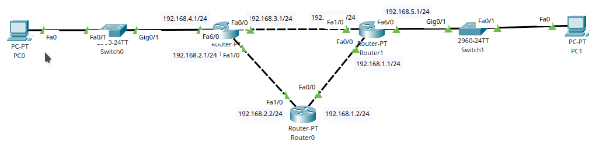
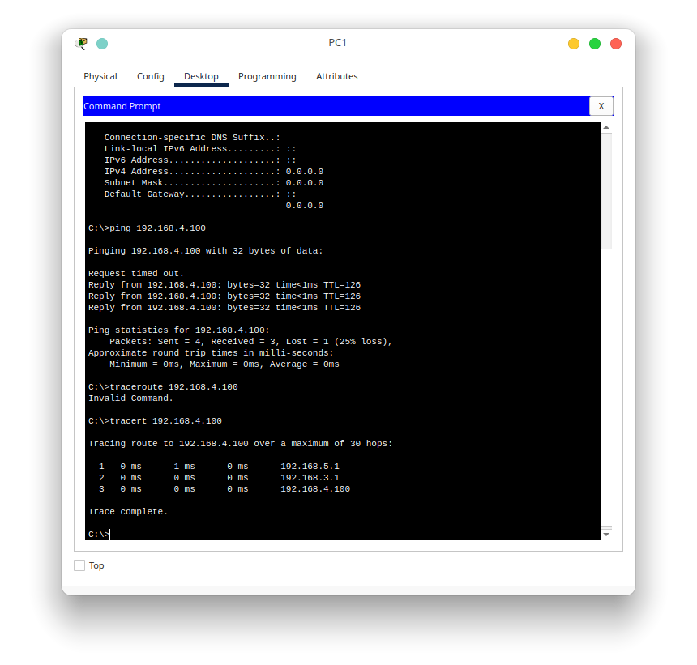
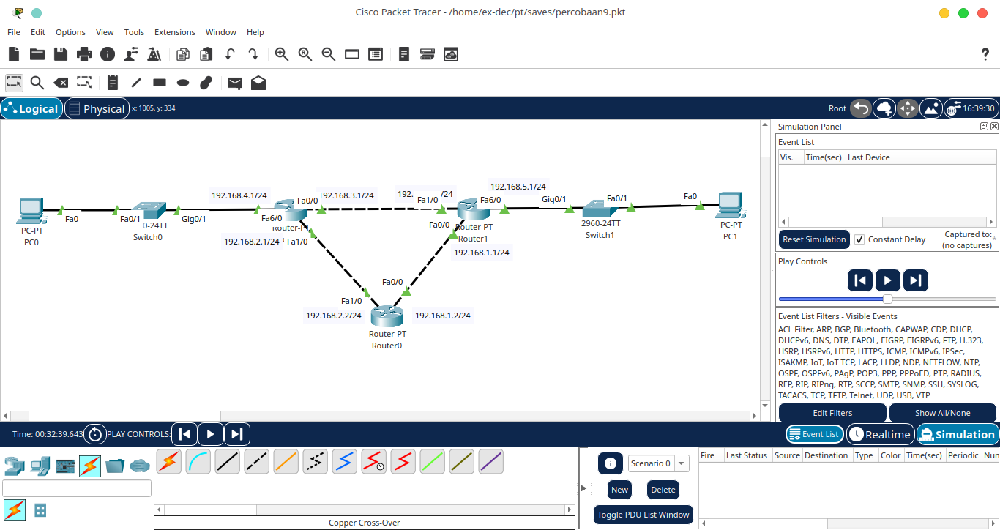
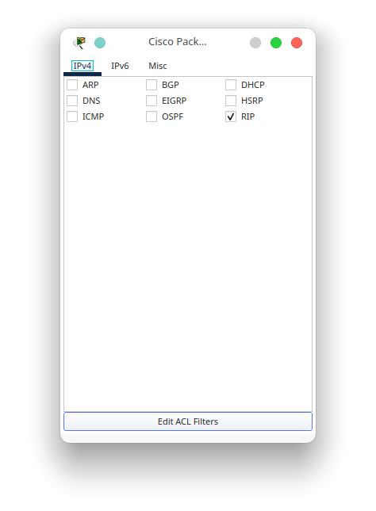
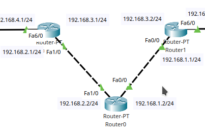

# Praktikum 8 - Dynamic Routing
## A. Pendahuluan
Dynamic Routing adalah salah satu metode untuk membuat routing table secara dinamis. Apabila sebelumnya kita menambahkan routing secara manual ke semua router yang terhubung, maka dengan menggunakan Dynamic routing ini semua tabel routing dari masing-masing router dapat saling bersingkronisasi dan dapat melakukan update tabel routing secara berkala. Dari penjelasan sebelumnya, kita dapat mengklasifikasikan beberapa komponen yang terlibat dengan dynamic routing ini yaitu : 
1. Neighbour : router yang terhubung dengan router kita dan menggunakan protokol routing dinamis yang sama
2. Routing Protocol : protokol yang digunakan untuk mengimplementasikan dynamic routing
3. Routing Database : Data yang di share oleh router 1 dengan yang lain untuk melakukan penulisan tabel routing terbaik menurut protokol masing-masing

Semua protokol routing dinamis pasti memiliki ketiga komponen tersebut, yang berbeda hanya metode sharing database dari 1 router ke router yang lain.
## B. Klasifikasi routing dinamis

Routing dinamis diklasifikasikan berdasarkan cakupan dan metode pemilihan rute dari routing dinamis tersebut. Untuk klasifikasinya adalah sebagai berikut

Klasifikasi cakupan : 
1. IGP (Interior gateway protocol)

    Routing dengan jenis ini memiliki cakupan dalam 1 autonomous system (AS) saja. Apa itu autonomous system? Autonomous system adalah kumpulan routing yang dibawah kontrol 1 sistem atau admin. sistem atau admin ini sering dianggap sebagai 1 perusahaan yang memiliki kumpulan ip address atau dalam konteks yang lebih umum adalah sebuah ISP.

2. EGP (Exterior gateway protocol)

    Routing dengan jenis ini memiliki cakupan yang lebih luas. Dapat menghubungkan 1 atau lebih Autonomous System dalam sebuah routing protocol dan satu router. Umumnya router yang menggunakan routing protocol dengan jenis ini memiliki spesifikasi yang tinggi dan mampu menghandle tabel routing yang sangat banyak.

Selain klasifikasi cakupan, ada 1 klafisikasi lagi yaitu klasifikasi metode pemilihan jalur : 

1. Distance vector

    Routing dengan klasifikasi ini akan memilih jalur dengan cara melihat apakah jalur yang sudah terdefinisi dalam tabel routing dalam kondisi aktif atau tidak. Ketika statusnya connect maka jalur akan langsung dilewatkan melewati jalur tersebut. Tidak peduli apakah jalur tersebut memiliki traffic yang padat atau tidak. Routing protocol dengan klasifikasi ini antara lain RIP, IGRP, dan EIGRP.
2. Link-state

    Yang selanjutnya adalah Link-state routing protocol. Routing dengan klasifikasi ini akan melihat status jalur yang sudah terdefinisikan. Apabila link atau jalur yang sudah ada memiliki state padat atau terputus, maka routing dengan klasifikasi ini akan mencari jalur lain yang tercepat dan memiliki traffic yang lebih baik. Routing protocol yang termasuk dalam klasifikasi ini antara lain OSPF dan IS-IS.

## C. Dynamic Routing - RIP
Pada kesempatan kali ini, kita akan coba mempraktikkan konfigurasi routing dinamis dengan menggunakan protocol RIP. Sedikit kita ulas kembali, pada dasarnya konfigurasi yang wajib adalah konfigurasi network yang akan kita bagikan ke router lain, lalu konfigurasi neighbour atau router lain yang akan menerima routing pada network tersebut. Untuk praktik kali ini kita akan menggunakan topologi yang sama seperti kemarin. Bentuk topologinya adalah sebagai berikut

Setelah topologi sudah terbentuk, selanjutnya adalah mengkonfigurasi ip yang sudah tertera pada topologi tersebut. Untuk masing-masing pc disesuaikan dengan network dari masing-masing gateway. 

Router0

    interface FastEthernet0/0
     ip address 192.168.1.2 255.255.255.0
     no shutdown
    !
    interface FastEthernet1/0
     ip address 192.168.2.2 255.255.255.0
     no shutdown

Router1

    interface FastEthernet0/0
     ip address 192.168.1.1 255.255.255.0
     no shutdown
    !
    interface FastEthernet1/0
     ip address 192.168.3.2 255.255.255.0
     no shutdown
    !
    interface FastEthernet6/0
     ip address 192.168.5.1 255.255.255.0
     no shutdown

Router2

    interface FastEthernet0/0
     ip address 192.168.3.1 255.255.255.0
     no shutdown
    !
    interface FastEthernet1/0
     ip address 192.168.2.1 255.255.255.0
     no shutdown
    !
    interface FastEthernet6/0
     ip address 192.168.4.1 255.255.255.0
     no shutdown

Apabila semua sudah disesuaikan, sekarang kita menuju konfigurasi routing RIP nya.
Konfigurasi pertama yang dapat kita lakukan adalah penentuan versi dari protokol RIP. RIP sendiri memiliki 2 versi yaitu v1 dan v2. untuk perbedaannya sendiri terletak pada network yang di advertise. Pada v1, network yang diadvertise dapat ditentukan prefixnya berapa. Namun untuk v2, kita tidak dapat menentukan prefixnya atau boleh dibilang kita harus menggunakan prefix default pada kelas IP yang ada. Misal kita menggunakan IP Address 192.168.0.1 , IP tersebut termasuk dalam class C dan secara otomatis akan menggunakan prefix 24. Perintah yang dapat digunakan adalah 

    router rip
     version 2

Konfigurasi tersebut berlaku untuk kedua router. Konfiguras selanjutnya adalah network yang diadvertise atau dibagikan ke router lain. Untuk perintahnya sendiri cukup sederhana yaitu dengan menggunakan perintah

    router rip
     network <ip network>

Untuk penggunaan pada masing-masing router adalah sebagai berikut

Router0

    router rip
     network 192.168.1.0
     network 192.168.2.0

Router1

    router rip
     network 192.168.1.0
     network 192.168.3.0
     network 192.168.5.0

Router2

    router rip
     network 192.168.2.0
     network 192.168.3.0
     network 192.168.4.0

Setelah semua network sudah di advertise, sekarang kita akan mengkonfigurasi neighbour dari router tersebut. Untuk neighbour sebenarnya secara otomatis akan ditambahkan ketika kita mengadvertise network tadi. Jadi semua interface yang terhubung dengan network tersebut akan dibroadcast tabel routing oleh routernya sendiri. Namun disini kita akan mengkonfigurasi interface mana yang tidak membutuhkan broadcast tabel routing. Misal pada Router1, interface yang terhubung dengan switch pada client PC1 pasti tidak membutuhkan routing table karena tidak ada router lain yang terhubung dengan switch tersebut. Konfigurasi yang dapat diterapkan adalah passive interface. Perintah yang dapat digunakan antara lain

    router rip
     passive-interface <nama interface>

Untuk Router yang terhubung dengan client yaitu Router1 dan Router2, konfigurasinya dapat disesuaikan sebagai berikut

Router1

    router rip
     passive-interface fa6/0

Router2

    router rip
     passive-interface fa6/0

Setelah semua konfigurasi di atas sudah diterapkan, mari kita cek tabel routing pada salah satu router. 

Dapat kita lihat pada tabel routing tersebut telah ditambahkan juga network 192.168.4.0 dan 5.0 , padahal sebelumnya kita tidak menambahkan rute tersebut. Lalu untuk kode pada masing-masing network yang ditambahakan secara otomatis terdapat kode R yang menandakan entry tersebut dilakukan oleh protokol RIP. 

Ketika kita lakukan traceroute dari PC1 ke PC0, hasilnya adalah sebagai berikut

Pada hasil tersebut, dapat kita lihat bahwa paket melewati jalur yang atas dan yaitu gateway 192.168.5.1 dan 192.168.3.1 .

## D. Eksperimen

Pada percobaan kali ini kita akan melakukan eksperimen sedikit tentang routing RIP. Karena semua router dapat membagikan status routing ke router yang lain, maka kita akan melihat seberapa lama update yang diberikan pada semua router. Sebelumnya aktifkan mode simulation untuk melihat lalu lintas broadcast RIP nya dan melihat waktu sinkronasinya. 

selanjutnya, set filternya ke paket rip saja agar memudahkan kita dalam melihat log nya

Selanjutnya mari kita putus jalur dari Router1 dengan Router2

Sekarang kita jalankan prosesnya dengan menekan tombol play pada simulation. Hasilnya adalah sebagai berikut

Dari komunikasi yang telah ditrace oleh mode simulation, dapat kita lihat bahwa proses sinkronasi terjadi cukup lama, antara 5-20 detik. Ini terjadi untuk topologi 3 router. Dapat kita bayangkan bagaimana jika router yang digunakan cukup banyak, seberapa lama jalur yang putus tadi terdeteksi oleh sistem. Sekarang kita coba cek routing table dari router0, apakah ada perubahan atau tidak.

routing table pada Router0 juga ada perubahan. Perubahan tersebut ada pada network 192.168.3.0 yang terlihat bahwa statusnya down. Sekarang mari kita lihat hasil traceroute terbaru dari PC1 menuju PC0

Ternyata gateway yang dilewati oleh paket tersebut bertambah 1 yaitu 192.168.1.2 dan ada perubahan pada gateway selanjutnya yaitu menuju 192.168.2.1