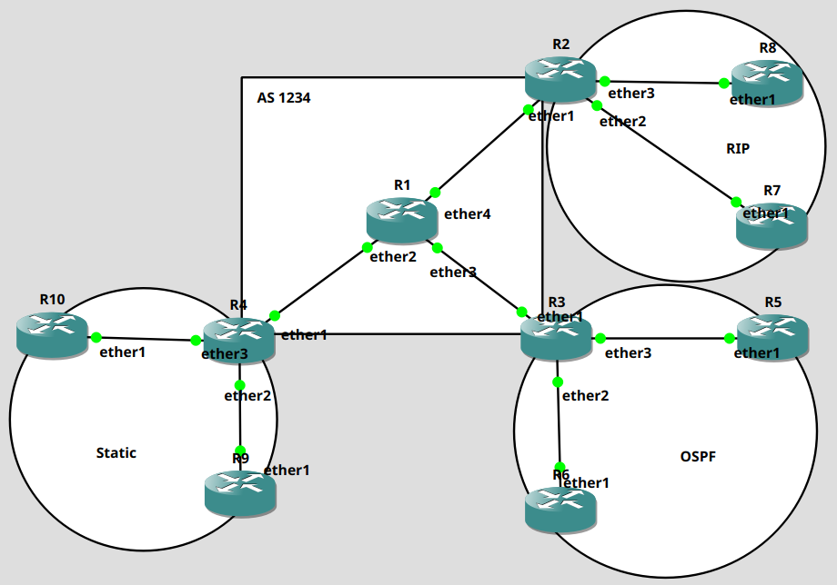

# Praktikum 9 - Internal BGP
## A. Pendahuluan
Salah satu jenis dynamic routing adalah BGP. BGP bekerja dengan cara melakukan peering terhadap router yang lain. Peering dilakukan untuk mendistribusikan tabel routing ke router lain. Sekarang mari kita lakukan praktikum berikut.

## B. Topologi
Sebelumnya mari kita buat topologi seperti gambar di bawah ini.

## C. Ruang Lingkup Kerja

Pada topologi di atas terdapat 10 buah router yang terhubung. Pada R1, R2, R3, dan R4 berjalan Routing IBGP dengan Autonomous System 1234. R2, R3, dan R4 bertindak sebagai border router pada jaringan tersebut yang menghubungkan protokol routing berbeda di setiap routernya. Routing yang di handle oleh R2 adlah RIP, R3 menghandle routing OSPF, dan R4 menghandle routing static. Tujuannya adalah menghubungkan semua router pada jaringan tersebut, jadi antar tabel routing dapat saling tersinkronasi. Untuk distribusi IP pada jaringan tersebut adalah sebagai berikut.

|Perangkat|interface|Ip address|Gateway|Routing type|
|-|-|-|-|-|
|R1|ether2|14.14.14.1/24||bgp|
||ether3|13.13.13.1/24||bgp|
||ether4|12.12.12.1/24||bgp|
|R2|ether1|12.12.12.2/24|12.12.12.1|bgp|
||ether2|27.27.27.2/24||rip|
||ether3|28.28.28.2/24||rip|
|R3|ether1|13.13.13.3/24|13.13.13.1|bgp|
||ether2|36.36.36.3/24||ospf|
||ether3|35.35.35.3/24||ospf|
|R4|ether1|14.14.14.4/24|14.14.14.1|bgp|
||ether2|41.41.41.4/24||static|
||ether3|49.49.49.4/24||static|
|R5|ether1|35.35.35.5/24|35.35.35.3|ospf|
||lo0|50.50.50.50/32|||
|R6|ether1|36.36.36.6/24|36.36.36.3|ospf|
||lo0|60.60.60.60/32|||
|R7|ether1|27.27.27.7/24|27.27.27.2|rip|
||lo0|70.70.70.70/32|||
|R8|ether1|28.28.28.8/24|28.28.28.2|rip|
||lo0|80.80.80.80/24|||
|R9|ether1|49.49.49.9/24|49.49.49.4|static|
||lo0|90.90.90.90/32|||
|R10|ether1|41.41.41.10/24|41.41.41.4|static|
||lo0|100.100.100.100/32|||

Untuk spesifikasi dari masing-masing routing adalah sebagai berikut

|Jenis routing|Spesifikasi|
|-|-|
|bgp|as number : 1234|
|ospf|area : backbone-lab|

## D. Tabel Routing

Dari ruang lingkup kerja diatas, hasil tabel routingnya adalah sebagai berikut

Pada tabel routing R1 di atas, semua network yang ada pada tabel distribusi IP sudah otomatis tercantum. Begitu pula dengan tabel routing yang lain

Namun pada bagian R4 tidak menerima tabel routing tersebut karena masih routing yang digunakan masih routing static.

## E. Hasil pekerjaan

Pada tabel routing di atas sebenarnya dapat disimpulkan bahwa praktikum ini selesai karena semua network pada jaringan tersebut telah diterima oleh semua router. Namun untuk memastikan hal tersebut, mari kita lakukan percobaan ping pada router tersebut

1. ping R10 ke R6

2. ping R5 ke R9

3. ping R7 ke R6

4. ping R8 ke R10

Sekian dari praktikum ini, untuk kurang lebihnya silahkan tambahkan issuenya ya. Terima kasih